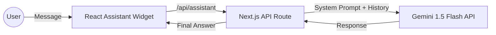

# 🚀 Building 'Sai's Persona Assistant (PA)'

This guide explains how I built the interactive AI assistant for your portfolio. This agent is designed to be **modular**, **secure**, and **cost-efficient** (staying within the Gemini Free Tier).

## 🛠️ The Architecture

The assistant follows a standard **Client-Server Architecture** to ensure your API keys are private and the AI's behavior is consistent.



---

## 1. Context Injection (The AI's Brain)
Rather than a generic chatbot, we turned this agent into **YOUR** assistant by feeding it your portfolio data.

- **How it works**: In `src/app/api/assistant/route.ts`, I serialized your `lib/data.ts` (projects, skills, etc.) into a **System Instruction**.
- **Result**: The AI knows exactly what you've built, where you've worked, and your preferred tech stack without needing extra training.

## 2. Rate Limiting (Staying Free)
The Gemini Free Tier allows for approx 15 RPM (Requests Per Minute). To protect your portfolio from abuse or high-traffic spikes:

- **Implementation**: I added an **In-Memory Sliding Window** rate limiter in the Backend API.
- **Limit**: Strictly enforced at **15 RPM**.
- **Fallback**: If a user is too chatty, the PA politely asks them to wait 60 seconds.

## 3. Modular Frontend Design
The assistant is encapsulated in `src/components/ai/AssistantWidget.tsx`.

- **Self-Contained**: It manages its own state, chat history, and animations.
- **Portability**: To use this in another project, you simply:
  1. Copy the `src/app/api/assistant` folder.
  2. Copy the `src/components/ai` folder.
  3. Ensure the `lib/data.ts` equivalent exists.

---

## 🚦 How to Deploy

1. **Step 1: API Key**
   Get your free Gemini API key from [Google AI Studio](https://aistudio.google.com/).

2. **Step 2: Environment Variables**
   Create a `.env` file in your root directory and add:
   ```env
   GEMINI_API_KEY=your_actual_api_key_here
   ```

3. **Step 3: Test**
   Ask it: *"What is Sayooj's best project?"* or *"Tell me about his Laravel skills."*

---

> [!TIP]
> **Developer Note**: Because we used the **Gemini 1.5 Flash** model, the response time is extremely fast while maintaining sophisticated reasoning. This makes the "PA" feel alive and responsive.
